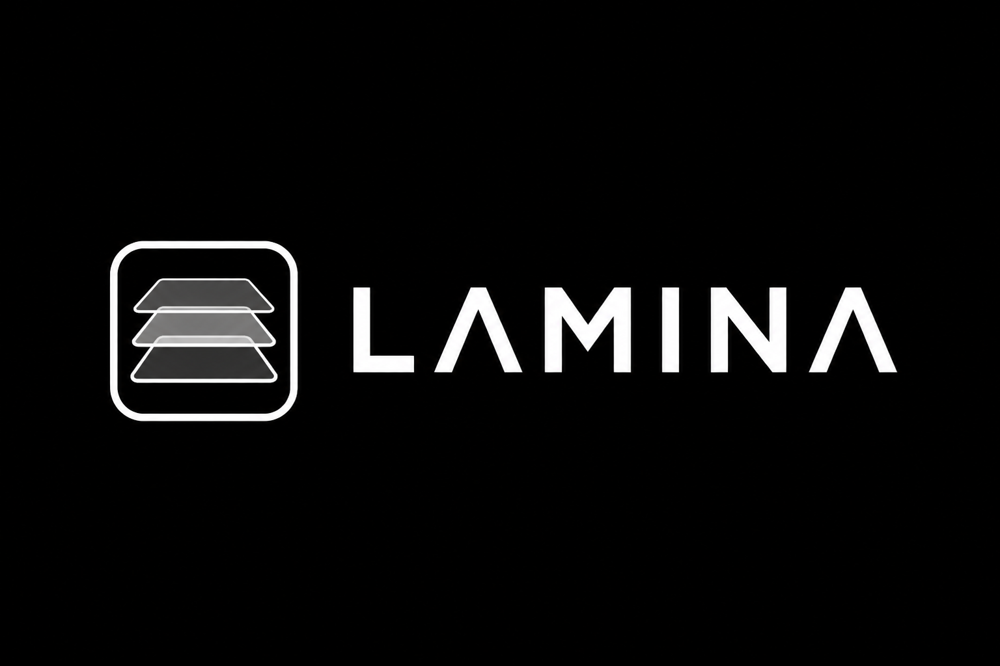

<p align="center">
  
</p>

# Lamina

> [!NOTE]
> Early work-in-progress. APIs and visuals will change. Fine for sibling apps (Terra, Visage); not a polished published toolkit yet.

**Lamina** is a reusable **wgpu immediate-mode UI toolkit** (not egui) and design system, shared by [Terra](https://github.com/xKrvZ/Terra) (landscapes) and [Visage](https://github.com/xKrvZ/Visage) (face / character animation).

It is domain-neutral: no terrain or character types, no product chrome. Apps own the window and event loop. Typical frame: 3D (or other) pass first, then `GuiRenderer::render` with `LoadOp::Load`, then a single present.

## Stack

- **wgpu 24** — Lamina draws into the app’s existing surface
- **No winit** — the host owns input and the event loop (Terra/Visage use winit 0.30)
- **No domain types** — widgets and layout only; products keep their own crates

| Crate | Role |
|-------|------|
| `lamina` | Immediate-mode wgpu UI toolkit and design system |
| `lamina-test-gpu` | Headless GPU harness for GUI tests (dev-only) |

## Depend via path

Terra and Visage live as siblings under `GameDevTooling` and path-depend on this crate:

```toml
lamina = { path = "../Lamina/crates/lamina" }
```

Pin **wgpu 24** to match this crate.

## Build

```bash
cargo test -p lamina
cargo check -p lamina
```

GPU tests skip when no adapter is available.

## License

Licensed under the [MIT License](LICENSE).
